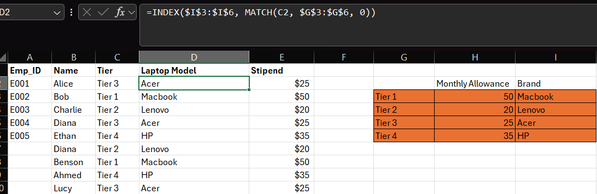

# Excel Employee Data Lookup Automation

## 📋 Project Overview
This project demonstrates advanced data restructuring and lookup automation techniques in Microsoft Excel. I transformed a fragmented, redundant human resources dataset into a clean, dynamic spreadsheet model where employee tiers automatically drive asset assignments and monthly stipends.

## 🛠️ Skills Demonstrated
* *Data Restructuring:* Eliminated redundant columns and separated primary data from reference tables.
* *Advanced Formulas:* Implemented dynamic =INDEX(..., MATCH(...)) lookups.
* *Cell Referencing:* Used absolute references ($) to lock reference table matrices for seamless formula dragging.

## 🔍 Formula Preview
Here is a look at the dynamic formula implementation:

